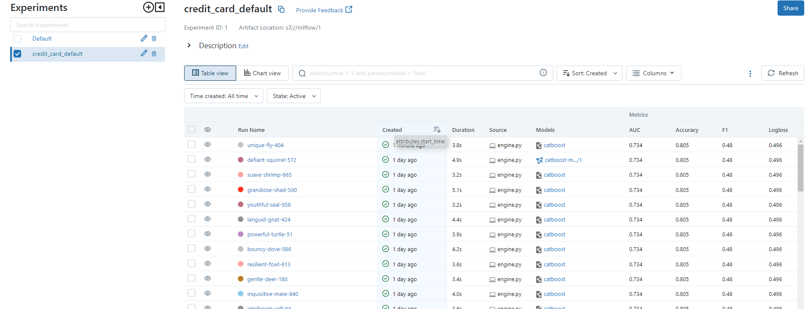
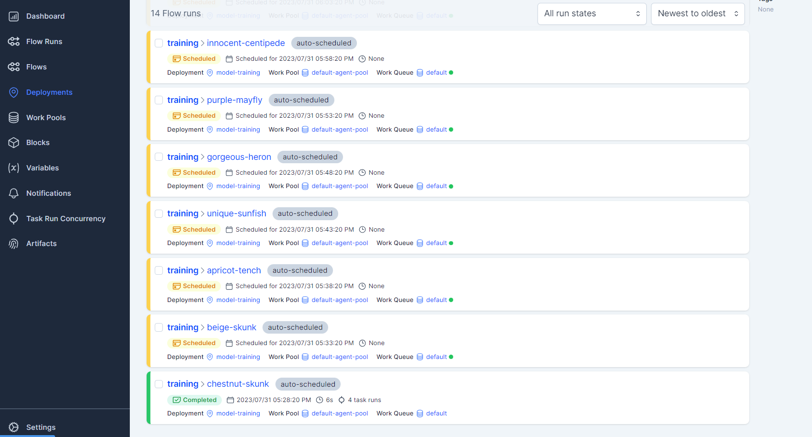
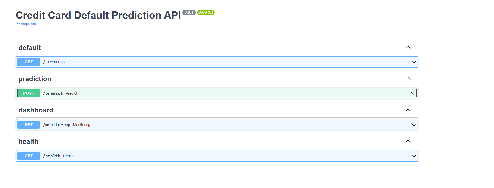
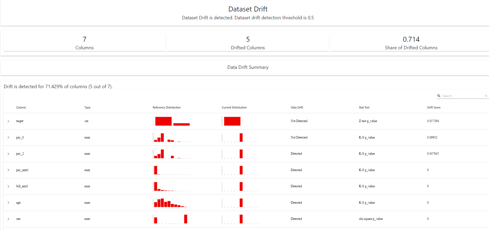

# Credit Card Default Prediction

This project aims to predict whether a credit card holder will default on their payment next month based on their demographic and payment history data.

## Problem statement

Credit card companies need to be able to predict which customers are likely to default on their payments in order to minimize their financial losses. This project aims to build a machine learning model that can accurately predict whether a credit card holder will default on their payment next month based on their demographic and payment history data.

## Dataset

The dataset used in this project is the [UCI Credit Card Default Payment dataset](https://archive.ics.uci.edu/ml/datasets/default+of+credit+card+clients). It contains information on credit card holders in Taiwan from April 2005 to September 2005, including demographic data, payment history, and default payment status.

## Approach

The project follows the following approach:

1. Model training and evaluation : A machine learning model is trained evaluated
2. Model tracking: The trained model is tracked using MLflow.
3. Workflow automation: The model training process is automated using Prefect.
4. Model deployment: The trained model is deployed using FastAPI.
5. Model monitoring: The deployed model is monitored to ensure that it continues to perform well.

## Requirements

The project requires the following dependencies:

- Python 3.6 or higher
- Docker

## Usage

To run the project, follow these steps:

1. Clone the repository: `git clone https://github.com/amine-akrout/mlops-zoomcamp-capstone.git`
2. Setup the environment: `Make setup`
3. Run docker-compose: `Make docker-stack`
This will start the MLflow server, the Prefect server, the Prefect agent and the fastapi (prdiction service) server.
4. Deploy the Prefect workflow: `Make deploy-prefect`

| **Service Name** | **Port** | **Description**                           |
|------------------|----------|-------------------------------------------|
| _minio_          | 9000     | MinIO object storage server               |
| _mlflow_         | 5000     | MLflow server for managing ML experiments |
| _mlflow_db_      | 3307     | MySQL database for MLflow                 |
| _phpmyadmin_     | 8081     | Web-based MySQL database administration   |
| _fastapi-app_    | 8000     | FastAPI application                       |
| _mongo_          | 27017    | MongoDB database server                   |
| _mongo-express_  | 8082     | Web-based MongoDB administration          |
| _prefect_server_ | 4200     | Prefect server for workflow management    |
| _agent_          | N/A      | Prefect agent for executing workflows     |
| _prefect_deploy_ | N/A      | Prefect deployment for workflows          |

<table>
<tr>
<td style="width: 50%">
<h3>MLflow tracking UI</h3>

</td>
<td>
<h3>Prefect Deployed workflow</h3>

</td>
</tr>
<td style="width: 50%">
<h3>Deployed Model with FastAPI</h3>

</td>
<td style="width: 50%">
<h3>Model Monitoring with Evidently</h3>

</td>
</table>
